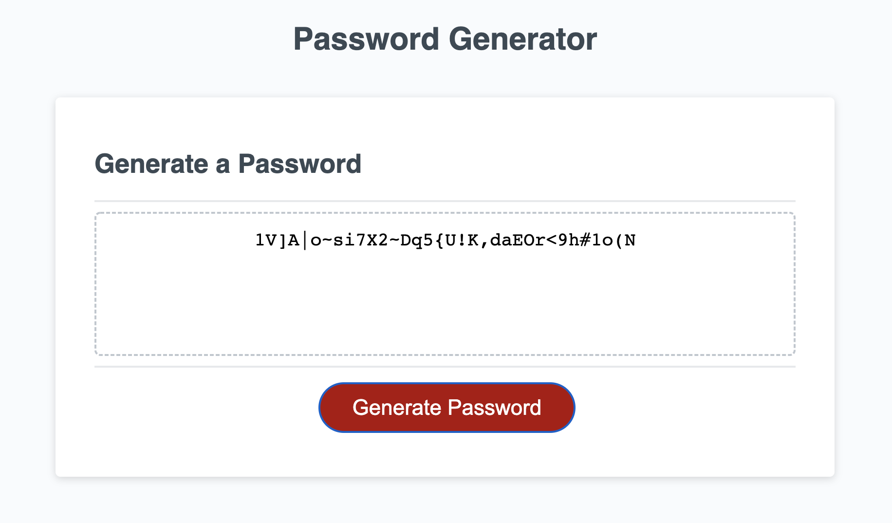

# password-generator

[Link to the working Page](https://sayamgautam1.github.io/password-generator/)

# Description

This page enables user to generate random passwords based on criteria that they’ve selected. The page will run in the browser and will feature dynamically updated HTML and CSS powered by JavaScript to generate random password of the user's choice

# Purpose

As a user, the need to randomly generate a password that meets certain criteria, thus this page can create a strong password that provides greater security.

# Features

When needed a new password, click the generate password button.  
The user is prompted with series of password criteria, such as including uppercase, lowercase , numbers and symbols.  
The user is asked to input atleast one character to move forward.  
Once the prompt criteria is met the user is prompted with the length of the password they require.  
The user is requried to input the length of the password to be atleast 8 characters and no more than 128 characters.  
The password is generated and displayed inside the page once all criteia are met.

# Built With

HTML

CSS

JavaScript
